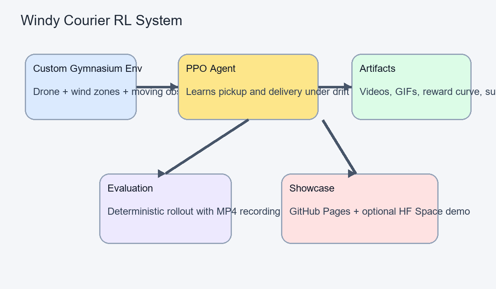
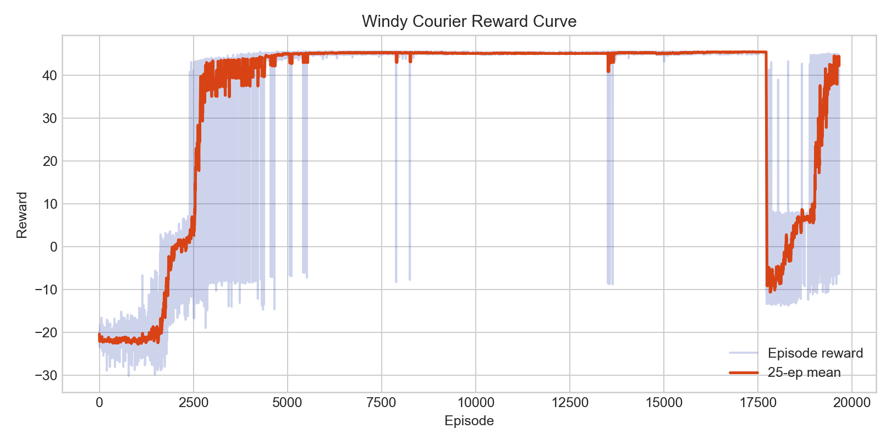
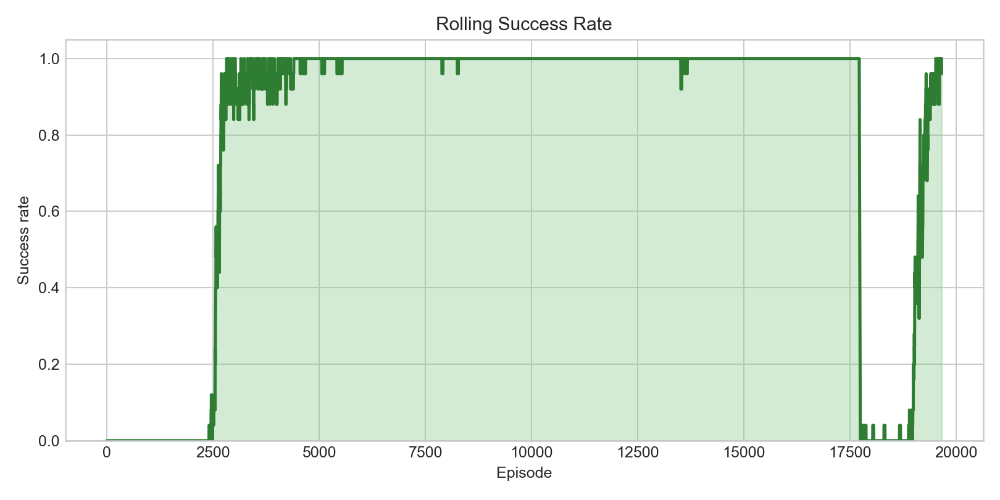

# Windy Courier RL

Windy Courier is a compact reinforcement learning project built to present well in an interview setting. A courier drone learns to pick up a package, navigate shifting wind zones, avoid a moving obstacle, and complete the delivery in a custom 2D environment.

The project is intentionally small enough to understand quickly, but polished enough to show the full RL loop: custom environment design, PPO training, evaluation, rollout recording, plots, GIF generation, and a lightweight demo app.

## What Makes This Worth Showing

- Custom Gymnasium environment with non-trivial dynamics
- PPO training pipeline using Stable-Baselines3
- Automatically recorded milestone videos during training
- Reward and success-rate plots for visible learning progress
- Static web demo and Hugging Face Space app included

## Demo Gallery

### Learning Progression


### Final Project Snapshot

<p align="center">
  
  
</p>

<p align="center">
  
</p>

### Recorded Rollouts

- [Baseline random policy video](web/media/baseline_random.mp4)
- [Final trained policy video](web/media/trained_final.mp4)

## Environment Summary

The agent operates in a 2D courier task with:

- discrete thrust actions
- local wind zones that alter motion
- a package pickup objective
- a delivery goal
- a moving obstacle that can end the episode
- reward shaping based on progress toward the current objective

This is a good RL problem because the correct action depends on future consequences, not just the current frame. The policy has to learn control, timing, and recovery under changing dynamics.

## Observation, Action, Reward

**Observation**

The state includes:

- agent position
- agent velocity
- goal position
- package picked flag
- package position
- obstacle position
- local wind vector

**Action space**

The action space is discrete with 5 actions:

- stay
- thrust up
- thrust down
- thrust left
- thrust right

**Reward design**

- positive reward for package pickup
- larger reward for successful delivery
- shaping reward for reducing distance to the current target
- small step penalty for efficiency
- penalties for collision and going out of bounds

## Repo Layout

```text
.
|-- src/
|   |-- envs/
|   |   |-- windy_courier_env.py
|   |   `-- __init__.py
|   |-- train.py
|   |-- evaluate.py
|   |-- play.py
|   |-- record_progress.py
|   `-- utils.py
|-- assets/
|-- web/
|   |-- index.html
|   |-- style.css
|   |-- app.js
|   `-- media/
|-- huggingface_space/
|   |-- app.py
|   `-- requirements.txt
|-- train.py
|-- main.py
`-- README.md
```

## Quick Start

Install dependencies:

```bash
pip install -r requirements.txt
```

Train the agent:

```bash
python -m src.train --total-timesteps 300000 --save-dir assets
```

Evaluate and record:

```bash
python -m src.evaluate --model-path assets/final_model/model.zip --record
```

Generate plots and GIFs:

```bash
python -m src.record_progress --log-dir assets --out-dir assets
```

## Live Demo Modes

Run the trained agent in the pygame viewer:

```bash
python -m src.play --mode agent --model-path assets/final_model/model.zip --deterministic
```

Play manually:

```bash
python -m src.play --mode human
```

Human mode supports `WASD` or arrow keys for movement, `Space` to brake, and `Esc` to quit.

## Hugging Face Space

The repo includes a simple inference-only Gradio app in [huggingface_space/app.py](huggingface_space/app.py).

To deploy it:

1. Create a new Gradio Space on Hugging Face.
2. Upload `huggingface_space/app.py` and `huggingface_space/requirements.txt`.
3. Upload the trained model to `assets/final_model/model.zip`, or adjust the path in the app.
4. Launch the Space.

## GitHub Pages

The `web/` folder is already structured for a static project page.

To publish it:

1. Push the repo to GitHub.
2. Make sure `web/media/` contains the latest generated assets.
3. In GitHub, open `Settings -> Pages`.
4. Choose `Deploy from a branch`.
5. Select your main branch and the `/web` folder.

## Why This Reads Well In An Interview

- It demonstrates end-to-end RL ownership, not just model training
- The environment is custom, understandable, and visually explainable
- The artifacts make improvement visible without requiring the interviewer to run code
- The repo includes both engineering polish and presentation polish

## Potential Next Steps

- continuous control instead of discrete thrust
- domain randomization over wind layouts
- multi-delivery episodes
- richer observations such as obstacle velocity
- curriculum training on simpler maps first
